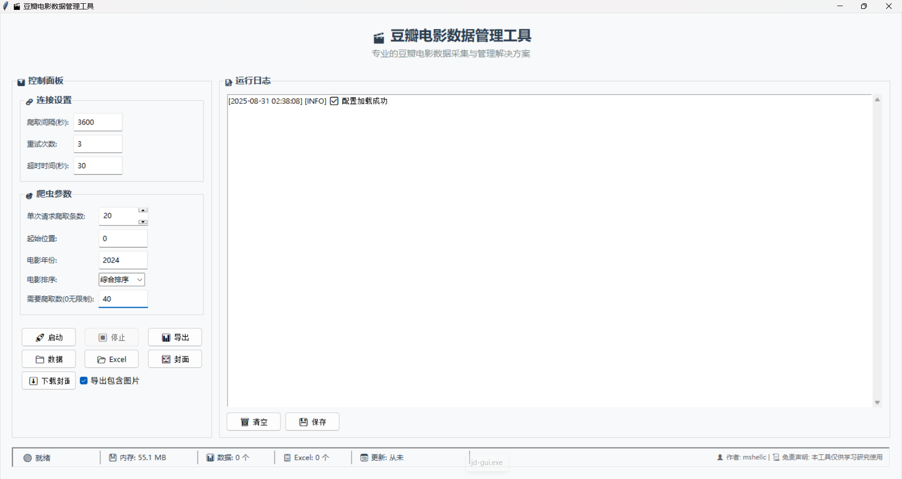

# 豆瓣电影数据管理工具

一个功能完整的豆瓣电影数据爬取和管理GUI工具，支持定时爬取、数据导出和可视化操作。（觉得好用的话可以点个star✨，感谢你的支持）

## ✨ 功能特性

- 🎯 **GUI界面**: 直观的图形用户界面，易于操作
- ⏰ **定时爬取**: 可配置的定时自动爬取功能，支持自定义间隔时间
- 📊 **数据导出**: 支持导出为Excel格式，包含完整电影信息
- 🖼️ **封面下载**: 自动下载电影高清封面，支持批量下载
- 📝 **日志管理**: 完整的运行日志记录，支持颜色分级显示
- 📊 **状态监控**: 实时状态栏显示文件统计、内存使用、最后更新时间
- 🎨 **主题支持**: 深色/浅色主题切换，现代化UI设计
- 🔄 **自动更新**: 长链接自动换行显示，优化日志可读性
- ⏹️ **进程管理**: 完善的进程控制，支持停止爬虫和取消定时任务
- 💾 **配置持久化**: 自动保存和加载用户配置

## 📸 界面截图

### 主程序界面



### 数据爬取页面


### 导出报表页面


### 下载图片页面


## 🚀 快速开始

### 环境要求

- Python 3.6+
- Windows 7/8/10/11 (推荐Windows 10+)

### 安装依赖

```bash
pip install -r requirements.txt
```

### 运行程序

```bash
# 方法一: 使用脚本
scripts\run_gui.bat

# 方法二: 直接运行
python src\douban_gui.py
```

### 打包为EXE

```bash
# 方法一: 使用一键打包脚本
scripts\打包.bat

# 方法二: 手动打包
python scripts\build_exe.py
```

**打包特性**:

- ✅ 自动版本控制（从VERSION文件读取版本号）
- ✅ 完整发布包（包含exe、配置、源代码）
- ✅ 自动清理中间产物
- ✅ zip压缩便于分发

### 📦 发行版下载

最新的发布版本可以在 [GitHub Releases](https://github.com/mshellc2021/douban-movie-crawler/releases) 页面下载：

- **v0.0.2**: [豆瓣电影爬虫工具_v0.0.2.zip](https://github.com/mshellc2021/douban-movie-crawler/releases/download/v0.0.2/豆瓣电影爬虫工具_v0.0.2.zip)

每个发布包包含：

- 🎯 可执行程序 (.exe)
- 📋 配置文件
- 📖 使用说明文档
- 🔧 源代码（供参考和学习）

## 📁 项目结构

```
douban_crawler/
├── src/                 # 源代码目录
│   ├── douban_gui.py    # 主GUI程序
│   ├── douban_crawler.py # 爬虫核心模块
│   └── export_to_excel.py # Excel导出模块
├── tests/               # 测试文件
├── scripts/             # 脚本文件
├── docs/                # 项目文档
├── data/                # 数据存储
├── exports/             # Excel导出文件
├── images/              # 图片资源
├── logs/                # 日志文件
├── build/               # 构建临时文件
├── dist/                # 打包输出
└── release/             # 发布版本
```

详细的项目结构说明请查看 [docs/项目结构说明.md](docs/项目结构说明.md)

最新功能更新说明请查看 [docs/功能更新说明.md](docs/功能更新说明.md)

## ⚙️ 配置说明

编辑 `config.json` 文件来自定义程序行为：

```json
{
  "crawl_interval": 3600,
  "max_retries": 3,
  "timeout": 30,
  "output_directory": "data",
  "log_level": "INFO"
}
```

## 📊 数据格式

爬取的数据保存为JSON格式，包含完整的电影信息：

- 电影标题、评分、导演、演员
- 上映时间、类型、地区
- 简介、海报链接
- 豆瓣链接、评价人数

## 🎯 使用方法

### 图形界面操作

1. 启动程序后，在主界面输入豆瓣电影链接
2. 点击"开始爬取"按钮开始数据收集
3. 使用"导出Excel"按钮导出数据
4. 通过菜单访问各种功能

### 命令行操作

```bash
# 直接运行爬虫
python src\douban_crawler.py

# 导出数据到Excel
python src\export_to_excel.py
```

## 🔧 开发指南

### 代码结构

- `src/douban_gui.py`: 主GUI程序，基于tkinter
- `src/douban_crawler.py`: 爬虫核心逻辑
- `src/export_to_excel.py`: Excel导出功能
- `tests/`: 单元测试和功能测试

### 添加新功能

1. 在src目录下创建新的模块
2. 更新GUI界面添加相应的控制
3. 编写测试用例
4. 更新文档

## 📝 更新日志

### v0.0.2 (2025-08-31)

- ✅ **定时任务优化**: 修复定时任务重启逻辑，支持取消定时回调
- ✅ **状态栏增强**: 实时显示数据文件统计、Excel文件数量、最后更新时间
- ✅ **进程管理**: 完善停止爬虫功能，支持定时任务模式下的正常停止
- ✅ **内存监控**: 实时显示程序内存使用情况
- ✅ **性能优化**: 日志批量处理，减少UI刷新频率

### v0.0.1 (2025-08-31)
- ✅ 项目结构优化完成
- ✅ 所有源代码添加作者信息
- ✅ GitHub上传准备就绪
- ✅ 完整的文档体系
- ✅ 自动版本控制打包系统
- ✅ 完整发布包生成（包含源代码）
- ✅ 自动清理中间产物

## 🚧 下一版本开发计划 (v0.1.0)

### 🎯 核心功能增强
- 🔄 **豆瓣电影Top500支持**: 自动爬取豆瓣电影Top250/Top500榜单数据
- 📊 **批量导出优化**: 支持Top500数据的完整导出和统计分析
- 🎨 **UI界面升级**: 为Top500功能添加专门的界面和控制选项

### ⚡ 技术改进
- 🚀 **性能优化**: 优化大规模数据爬取的效率和稳定性
- 📦 **数据存储**: 改进Top500数据的存储结构和查询性能
- 🔧 **API扩展**: 增强爬虫核心对豆瓣不同榜单的支持

### 📋 预计功能
- ✅ 支持豆瓣电影Top250完整爬取和导出
- ✅ 支持豆瓣电影Top500完整爬取和导出  
- ✅ 新增Top500专用界面和操作面板
- ✅ 批量导出Top500数据到Excel
- ✅ 数据去重和完整性校验
- ✅ 进度显示和错误处理机制

## 🤝 贡献指南

1. Fork 本项目
2. 创建特性分支 (`git checkout -b feature/AmazingFeature`)
3. 提交更改 (`git commit -m 'Add some AmazingFeature'`)
4. 推送到分支 (`git push origin feature/AmazingFeature`)
5. 打开Pull Request

## 📄 许可证

本项目采用 MIT 许可证 - 查看 [LICENSE](LICENSE) 文件了解详情

## 👥 作者

**mshellc**

- 📧 邮箱: mshellc@foxmail.com
- 🔧 项目开发与维护

💡 **有需求或问题请联系邮箱沟通**

## 🙏 致谢

- 豆瓣网提供电影数据
- Python社区提供的优秀库
- 所有贡献者和用户

## ⚠️ 注意事项

1. 请合理使用，避免对豆瓣服务器造成过大压力
2. 遵守豆瓣的robots.txt协议
3. 数据仅用于个人学习和研究目的
4. 建议在非高峰时段运行爬虫

## 📜 免责声明

⚠️ **重要声明**: 本项目代码仅供学习和研究目的使用。使用者应遵守相关法律法规和网站的使用条款。作者不对因使用本项目而产生的任何直接或间接损失负责。请合理使用网络资源，尊重数据来源方的权益。

## 📞 技术支持

如果遇到问题，请：

1. 查看 [docs/使用说明.md](docs/使用说明.md)
2. 检查日志文件 `logs/douban_crawler.log`
3. 确保网络连接正常
4. 验证Python环境配置

---

**祝您使用愉快！** 🎬

## ⭐ 支持项目

如果这个项目对您有帮助，请给它一个Star！您的支持是我持续更新的动力！

- ⭐ **Star这个项目** - 让更多人发现这个有用的工具
- 🐛 **报告问题** - 帮助改进项目质量
- 💡 **提出建议** - 分享您的想法和需求
- 🤝 **参与贡献** - 欢迎提交Pull Request

感谢您的支持！ 🙏
