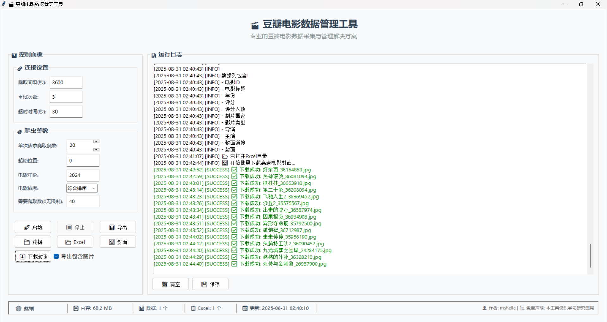

# 豆瓣电影爬虫工具 - 使用说明

## 🎯 程序功能
- **数据爬取**: 豆瓣电影数据自动爬取，支持定时任务
- **数据导出**: 导出为Excel格式，包含完整电影信息
- **封面下载**: 高清电影封面批量下载
- **日志管理**: 实时日志显示，支持颜色分级
- **状态监控**: 状态栏实时显示文件统计、内存使用、更新时间
- **定时任务**: 可配置的自动爬取间隔，支持启用/禁用
- **进程控制**: 完善的进程管理，支持停止爬虫和取消定时任务

## 📸 界面截图

### 主程序界面


### 数据爬取页面


### 导出报表页面


### 下载图片页面



## 📦 打包说明

### 方法一：使用打包脚本（推荐）
1. 运行 `打包.bat` 文件
2. 按照提示操作即可自动完成打包

### 方法二：手动打包
1. 确保已安装Python 3.6+
2. 安装依赖：`pip install -r requirements.txt`
3. 安装PyInstaller：`pip install pyinstaller`
4. 运行打包脚本：`python scripts\build_exe.py`

### 打包特性
- **自动版本控制**: 从VERSION文件读取版本号
- **完整发布包**: 包含exe、配置文件、源代码和完整目录结构
- **自动清理**: 打包完成后自动删除中间产物
- **zip压缩**: 生成单个zip文件便于分发

## 🚀 部署到其他电脑

### 方法一：使用发布包（推荐）
1. 解压 `豆瓣电影爬虫工具_v0.0.2.zip` 到任意位置
2. 直接运行 `豆瓣电影爬虫工具.exe`
3. 程序包含完整的目录结构和源代码

### 方法二：直接使用exe文件
1. 将 `dist\豆瓣电影爬虫工具.exe` 复制到目标电脑
2. 手动创建必要的目录结构（data/, exports/, images/, logs/）
3. 复制config.json配置文件

### 方法二：源代码部署
1. 复制整个项目文件夹
2. 确保目标电脑安装Python 3.6+
3. 安装依赖：`pip install -r requirements.txt`
4. 运行：`python douban_gui.py`

## 🎮 功能操作指南

### 定时任务使用
1. **启用定时任务**: 勾选"启用定时任务"复选框
2. **设置间隔时间**: 输入爬取间隔时间（秒）
3. **开始爬取**: 点击"开始爬取"按钮，程序会自动按设定间隔重复爬取
4. **停止定时任务**: 点击"停止爬虫"按钮，程序会取消所有定时回调

### 状态栏信息解读
- **📊 数据文件**: 显示data目录中的JSON文件数量和总大小
- **📋 Excel文件**: 显示exports目录中的Excel文件数量
- **📅 最后更新**: 显示最新数据文件的修改时间
- **💾 内存**: 显示程序当前内存使用量
- **🟢 就绪**: 程序当前状态（就绪/运行中/错误）

### 高级功能
- **批量下载封面**: 点击"下载高清封面"按钮批量下载所有电影的封面图片
- **数据导出**: 点击"导出Excel"按钮将数据导出为Excel格式
- **目录访问**: 使用右侧按钮快速打开数据、Excel、图片目录

## 📁 目录结构
```
py_project/
├── douban_gui.py          # 主程序
├── build_exe.py          # 打包脚本
├── 打包.bat              # 批处理打包文件
├── config.json           # 配置文件
├── requirements.txt      # 依赖文件
├── release/              # 发布包目录
│   └── 豆瓣电影爬虫工具_v0.0.1.zip # 完整发布包
└── dist/                 # 打包输出目录
    └── 豆瓣电影爬虫工具.exe
```

## ⚙️ 系统要求
- **Windows**: 7/8/10/11 (推荐Windows 10+)
- **内存**: 至少2GB RAM
- **磁盘空间**: 至少100MB可用空间
- **网络**: 需要互联网连接进行数据爬取

## ⚠️ 注意事项
1. **首次运行**: 可能会被Windows Defender拦截，请选择"允许运行"
2. **文件权限**: 程序需要写入文件的权限
3. **网络连接**: 爬取数据时需要稳定的网络连接
4. **杀毒软件**: 如果exe文件被误报，请添加到信任列表

## 🔧 故障排除

### 常见问题
1. **程序无法启动**: 检查是否被安全软件拦截
2. **爬取失败**: 检查网络连接是否正常
3. **文件无法保存**: 检查是否有写入权限

### 重新打包
如果遇到问题，可以重新运行打包脚本：
```bash
python build_exe.py
```

## 📞 技术支持
如果遇到问题，请检查：
1. 系统是否符合要求
2. 网络连接是否正常
3. 是否有足够的磁盘空间
4. 是否被安全软件拦截

## 📊 文件大小信息
- 源代码: ~50KB
- 打包后的exe: ~14.4MB
- 完整发布包: ~14.5MB

---
**祝您使用愉快！** 🎬